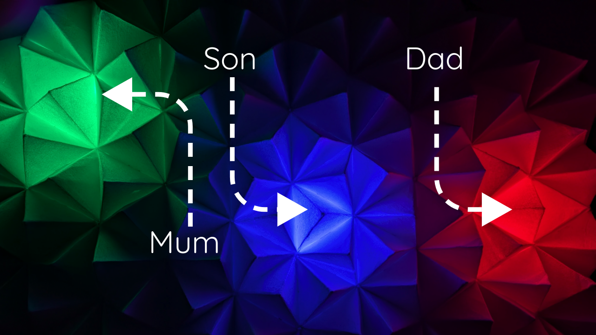

# LED Hexagon Family Tracker

---

This Raspberry Pi project is an **experiment in creating a dynamic family location tracker** using **MQTT**, **Node-RED**, **Folium**, and Adafruit's **NeoPixel library**. Watch it come to life with an LED hexagon display!

For a **full project write-up**, [click here](YOUR_FULL_PROJECT_WRITEUP_LINK_HERE). Or, to **see it in action**, watch the [YouTube video](YOUR_YOUTUBE_VIDEO_LINK_HERE)!

To dive into the **hardware setup details** (including how to create your secrets file), [check out my article on Medium](https://medium.com/dev-genius/building-a-raspberry-pi-5-family-location-tracker-with-node-red-mosquitto-and-owntracks-00f96f93b8f9?sk=3c86bc871a44135026a26f5778ca0315).

---

## Dependencies

* **Folium Library:** For generating interactive maps ([https://python-visualization.github.io/folium/latest/](https://python-visualization.github.io/folium/latest/))
* **Adafruit CircuitPython:** Essential for Pico development, along with their NeoPixel and MQTT libraries ([https://circuitpython.org/](https://circuitpython.org/))

---

## Folium Map Generation

The `hex_map_creator.py` script handles map generation. You'll need to **set your user requirements** within this file. When run, it uses `Triangle.py` and `map_leds.py` to produce a folder containing the generated HTML for the map, plus JSON data for Node-RED integration.

---

## Pico LED and MQTT

The `code.py` file is the main program that **automatically runs on Pico power-up**. It establishes a connection to your Wi-Fi and MQTT broker, then listens for incoming location data messages.

**Important:** You'll need to create your own `secrets.py` file to store sensitive information like Wi-Fi credentials and MQTT broker details. Refer to the hardware setup link above for more specific instructions.

---

## Node-RED Flows

This section includes an export of my Node-RED flows. These flows are responsible for **processing the incoming location data** and outputting the precise information needed for the Pico to illuminate the correct LEDs.